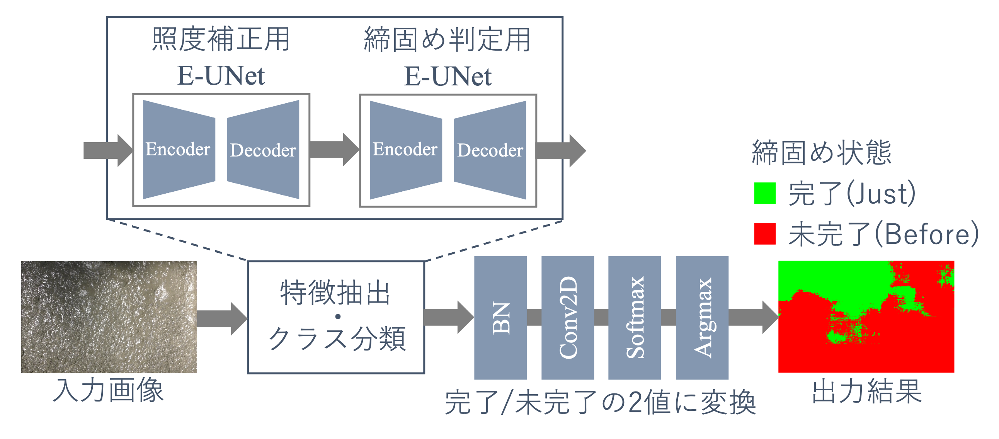
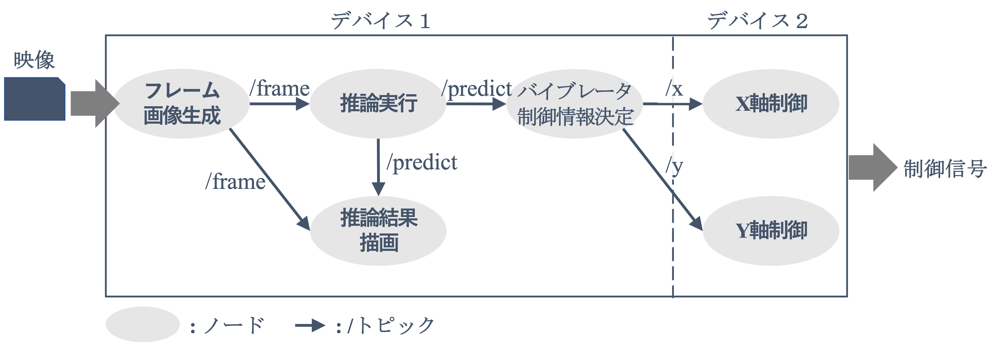

金沢工業大　長田 茂美 研究室 <br>
<h1 class="first">『深層学習に基づくコンクリートの締固め自動判定システムに関する研究』のマニュアル</h1>
<br>

執筆：長田 将&emsp;（2023年3月卒業）\
&emsp;&emsp;&emsp;山下 晴輝（2023年3月卒業）
<br>
<br>

1. [Semantic Segmentationに基づいた判定システムに関するマニュアル](#semantic-segmentationを用いた判定システムに関するマニュアル)
<br>
<br>

1. [ROSを用いた完全自動締固めシステムに関するマニュアル](#rosを用いた完全自動締固めシステムに関するマニュアル)

## 目次
- [Semantic Segmentationを用いた判定システムに関するマニュアル](#semantic-segmentationを用いた判定システムに関するマニュアル)
  - [はじめに](#はじめに)
    - [概要](#概要)
    - [締固め判定システムについて](#締固め判定システムについて)
    - [作業ディレクトリ](#作業ディレクトリ)
    - [メモリの解放](#メモリの解放)
  - [Docker環境構築](#docker環境構築)
    - [概要](#概要-1)
    - [ディレクトリ構成](#ディレクトリ構成)
    - [実行手順](#実行手順)
    - [ソースコード](#ソースコード)
      - [entrypoint.sh](#entrypointsh)
      - [Dockerfile](#dockerfile)
      - [build\_docker.sh](#build_dockersh)
      - [launch.sh](#launchsh)
    - [Dockerを使用する上での注意点](#dockerを使用する上での注意点)
    - [マルチGPU](#マルチgpu)
  - [データセットの概要](#データセットの概要)
    - [ディレクトリ構成](#ディレクトリ構成-1)
      - [はじめに](#はじめに-1)
      - [Docker環境内でのディレクトリ](#docker環境内でのディレクトリ)
      - [/workspace/fullframeの内容](#workspacefullframeの内容)
    - [テキストの内容](#テキストの内容)
  - [学習の回し方](#学習の回し方)
    - [最も単純な実行例](#最も単純な実行例)
    - [学習の詳細設定](#学習の詳細設定)
    - [学習済みモデルの保存](#学習済みモデルの保存)
      - [保存先](#保存先)
      - [保存されるモデルの内容](#保存されるモデルの内容)
    - [テスト結果の保存](#テスト結果の保存)
      - [保存結果のディレクトリ構成](#保存結果のディレクトリ構成)
    - [学習済みモデルの呼び出し](#学習済みモデルの呼び出し)
      - [TensorFlowの保存形式のモデル](#tensorflowの保存形式のモデル)
      - [Kerasの保存形式のモデル](#kerasの保存形式のモデル)
      - [エラーに関する補足](#エラーに関する補足)
    - [実装済みモデルへの細かな変更](#実装済みモデルへの細かな変更)
    - [新たな深層学習モデルの追加](#新たな深層学習モデルの追加)
      - [①](#)
      - [②](#-1)
      - [③](#-2)
    - [データセットの変更方法](#データセットの変更方法)
      - [①](#-3)
      - [②](#-4)
      - [③](#-5)
      - [④](#-6)
    - [その他](#その他)
      - [make, learnコマンドの定義](#make-learnコマンドの定義)
      - [Line Bot](#line-bot)
  - [ソースコードの概要](#ソースコードの概要)
    - [ディレクトリ構成](#ディレクトリ構成-2)
    - [ソースコードの内容](#ソースコードの内容)
      - [mymodel/SemSegLight.py](#mymodelsemseglightpy)
      - [SemanticSegmentationTrain.py](#semanticsegmentationtrainpy)
      - [SemanticSegmentationTest.py](#semanticsegmentationtestpy)
      - [make\_learning\_plan.py](#make_learning_planpy)
      - [train\_autoencoder.py](#train_autoencoderpy)
      - [MyUtils.py](#myutilspy)
    - [作業ディレクトリ](#作業ディレクトリ-1)
    - [学習の回し方](#学習の回し方-1)
    - [使用上の注意点](#使用上の注意点)
      - [Dockerのimageの適宜削除](#dockerのimageの適宜削除)
      - [キーボード配列の変更](#キーボード配列の変更)
- [ROSを用いた完全自動締固めシステムに関するマニュアル](#rosを用いた完全自動締固めシステムに関するマニュアル)
  - [はじめに](#はじめに-2)
    - [概要](#概要-2)
    - [完全自動締固めシステムについて](#完全自動締固めシステムについて)
  - [ROSの環境構築](#rosの環境構築)
  - [Docker環境構築](#docker環境構築-1)
    - [ディレクトリ構成](#ディレクトリ構成-3)
    - [実行手順](#実行手順-1)
    - [ソースコード](#ソースコード-1)
      - [Dockerfile](#dockerfile-1)
      - [build\_image.sh](#build_imagesh)
      - [launch.sh](#launchsh-1)
  - [システムの実行](#システムの実行)
    - [起動の手順](#起動の手順)
      - [起動しなかった時](#起動しなかった時)
    - [システムのソースコード](#システムのソースコード)
      - [ソースコードの一覧](#ソースコードの一覧)
      - [ソースコードの追加方法](#ソースコードの追加方法)
      - [ソースコードのバックアップ先](#ソースコードのバックアップ先)

<div style="page-break-before:always"></div>

# Semantic Segmentationを用いた判定システムに関するマニュアル

執筆：長田 将

## はじめに

### 概要
これは、『深層学習に基づくコンクリートの締固め自動判定システムに関する研究』のうち、深層学習に基づく判定システムの学習と評価に関するコード群の説明です。

### 締固め判定システムについて
本研究でいう「締固め判定システム」や「判定システム」とは、コンクリートの表面画像を入力とし、Semantic Segmentationに基づく画素単位の締固め完了判定を出力とする一連のシステムを指します。\
下に、締固め判定システムの構造を示します。



### 作業ディレクトリ
主な作業ディレクトリは、`/media/nagalab/SSD1.7TB/nagalab/osada_ws/concrete_compaction/`
で、学習に関する作業ディレクトリは、`/media/nagalab/SSD1.7TB/nagalab/osada_ws/concrete_compaction/KerasFramework-master_tf2/train/`
です。<br>
<br>
私の使っていたPCでは、コマンドライン上で
```
$ cdws
```
と打てば当該の作業ディレクトリへ移動できます。

### メモリの解放

Semantic Segmentationの実行には多量の計算資源を必要とします。<br>
キャッシュの解放のために下記のプログラムを、学習と同時に動かしてください。

\* `remove_cache.c`
```c
#include <stdio.h>
#include <stdlib.h>
#include <unistd.h>
#include <time.h>


int main(int argc, char **argv)
{
    
    // Sleepの秒数を設定
    int sleep_const = 10;

    if (argc > 1) {
        sleep_const = atoi(argv[1]);
    }

    // 無限ループ
    for (;;) {
        time_t t = time(NULL);
        printf("\n%s\n", ctime(&t));

        char command[128] = "echo <Your Password> | sudo -S sysctl -w vm.drop_caches=3";
        
        if (system(command) == -1) {
            printf("Could not excute...\n");
        } else {
            printf("\n");
        }

        sleep(sleep_const);
    }
    
    return 0;
}
```
C言語で記述しているので下記コマンドで実行します。
```
$ gcc remove_cache.c -o remove_cache
$ ./remove_cache
```

<!-- ### VSCode内のキーバインド

私のVSCodeでは、下記のバインドになっています。\
気になれば、VSCodeで、`[Ctrl] + [k]`&ensp;の後に&ensp;`[Ctrl] + [s]`&ensp;を押すとキーボードショートカットの設定画面が開くので、そこから変更してください。

```
[Ctrl] + [Shift] + [c]  : コピー ([Ctrl] + [c]にすると他のバインドに干渉します)
[Ctrl] + [v]            : ペースト
[Ctrl] + [c] + [↑]      : 上の行にコピー
[Ctrl] + [c] + [↓]      : 下の行にコピー

[Ctrl] + [d]            : 選択中の語句を丸ごと編集
[Ctrl] + [x]            : その行を丸ごと切り取り
[F12]                   : 選択中のオブジェクトの参照元を表示
[Alt] + [↑]             : その行を一つ上の行にシフト ([Option]でも可)
[Alt] + [↓]             : その行を一つ下の行にシフト

[Ctrl] + [n]            : パス名を指定してファイルを新規作成
[Ctrl] + [m]            : 編集中のファイルの名前を変更
[Ctrl] + [w]            : ファイルを閉じる
[Ctrl] + [o]            : フォルダを開く
[Ctrl] + [p]            : ファイル名を指定して開く

[Ctrl] + [Shift] + [p]  : VSCode内のコマンドを実行
[Ctrl] + [,]            : 環境設定(Preference)を開く
[Ctrl] + ([k] → [s])    : キーボードショートカットの設定を開く
[Ctrl] + [b]            : 横にあるファイラのバーを表示／非表示
[Ctrl] + [Shift] + [x]  : 拡張機能のバーを表示／非表示
``` -->


## Docker環境構築

### 概要

この研究では、実行環境の恒常性の確保のために「Docker」と呼ばれる仮想環境を用いて実験を行なっています。\
事前に、`sudo apt install docker`&ensp;等でDocker自体のパッケージを各PCに整えてください。

### ディレクトリ構成
- 任意のディレクトリ
  - Dockerfile
  - entrypoint.sh
  - build_docker.sh
  - launch.sh

### 実行手順

上記ディレクトリ内でコマンドラインを開いた上で、以下のいくつかのコマンドを実行します。\
\
①　まず、下記コマンドでDocker環境を構築します。初回実行時、または環境に変更を加えた時だけ実行すれば十分です。
```
$ sh build_docker.sh <任意のタグ名>
```

②　次に、下記コマンドでDocker環境を立ち上げます。①の実行後なら、このコマンドだけでいつでもDocker環境の中に入れます。
```
$ sh launch.sh <使用するGPU番号>
```

`<使用するGPU番号>`&ensp;は、使用するGPUの番号を指定します。Dockerコマンドにおいて&ensp;`GPU=`&ensp;でGPUの番号を指定することと等価です。\
例えば、`sh launch.sh 0`&ensp;なら0番目のGPUを使用、`sh launch.sh 1`&ensp;なら1番目を使用、`sh launch.sh all`&ensp;なら全てのGPUを使用します。


### ソースコード

#### entrypoint.sh
このコードでは、Docker環境の起動時の動作を指定しています。具体的には、ユーザーの権限を定義し、同時にDocker環境内でいくつかコマンドを実行しています。
```sh
#!/bin/bash

USER_ID=${LOCAL_UID:-9001}
GROUP_ID=${LOCAL_GID:-9001}

echo "Starting with UID : $USER_ID, GID: $GROUP_ID"
useradd -u $USER_ID -o -m user
groupmod -o -g $GROUP_ID user
export HOME=/home/user

echo "alias make='python /workspace/train/make_learning_plan.py'" >> /home/user/.bashrc
echo "alias learn='sh /workspace/train/learning_plan.sh'" >> /home/user/.bashrc
echo "alias plan='more /workspace/train/learning_plan.sh'" >> /home/user/.bashrc
echo "export TF_CPP_MIN_LOG_LEVEL=2" >> /home/user/.bashrc

. /home/user/.bashrc

exec /usr/sbin/gosu user "$@"
```

#### Dockerfile
このテキストは、Docker環境を構築するためのコマンドを列挙したものです。
```docker
FROM nvcr.io/nvidia/tensorflow:21.09-tf2-py3

RUN apt-get update && apt-get upgrade -y && apt-get -y install gosu vim graphviz v4l-utils ffmpeg
COPY entrypoint.sh /usr/local/bin/entrypoint.sh
RUN chmod +x /usr/local/bin/entrypoint.sh
ENTRYPOINT ["/usr/local/bin/entrypoint.sh"]

USER root

RUN apt-get install -y libgl1-mesa-dev
RUN pip install --upgrade pip

RUN pip install numpy==1.19.2
RUN pip install opencv-python
RUN pip install matplotlib
RUN pip install colorama
RUN pip install pillow
RUN pip install scikit-learn
RUN pip install pandas
RUN pip install pyyaml
RUN pip install argparse
RUN pip install pydot
RUN pip install tqdm
RUN pip install line-bot-sdk
RUN pip install sklearn
RUN pip install umap-learn
RUN pip install scikit-image
RUN pip install openpyxl
RUN pip install tensorflow_model_optimization
RUN pip install tensorflow==2.10.0
RUN pip install git+https://github.com/tensorflow/examples.git
```

#### build_docker.sh
このコードは、`Dockerfile`&ensp;に従って実際にDocker環境を構築するものです。また、Dockerには"タグ(tag)"と呼ばれるIDで環境を管理する機能があります。タグの指定もこのコードで行っています。
```sh
#!/bin/bash

if [ $# -ne 1 ]; then
    docker images
    echo;
    echo "タグ名の入力が必要" 1>&2
    exit 1
fi

cd /media/nagalab/SSD1.7TB/nagalab/osada_ws/docker
docker image build -t osada:$1 .
```

#### launch.sh
このコードは、構築済みのDocker環境を立ち上げた上で、その環境内に入るものです。最下行でタグを指定します。
```sh
#!/bin/bash

workspace="/media/nagalab/SSD1.7TB/nagalab/osada_ws"
dataset="/media/nagalab/SSD1.7TB/nagalab/Dataset"

if [ $# -ne 1 ]; then
    nvidia-smi
    echo;
    echo "GPUの番号も入力して" 1>&2
    exit 1
fi

xhost +

docker container run \
--rm --gpus "device=$1" -it \
-v $workspace/concrete_compaction/:/workspace/osada_ws \
-v $workspace/concrete_compaction/KerasFramework-master_tf2/train:/workspace/train \
-v $workspace/concrete_compaction/text_dataset/ngc_docker:/workspace/mesh_dataset \
-v $workspace/LuminanceData/:/workspace/luminance \
-v $workspace/semanticSegmentation/:/workspace/semanticSegmentation \
-v $workspace/fullframe/:/workspace/fullframe \
-v $workspace/visualization/:/workspace/visualization \
-v $workspace/hidden_layer/:/workspace/hidden \
-v $workspace/explain/:/workspace/explain \
-v $dataset/CompactionVideo/:/workspace/video \
-v $workspace/mesh_encoder_result/:/workspace/mesh_encoder_result \
-v $workspace/cpp/:/workspace/cpp \
-v $workspace/result_y/:/workspace/result_y \
-v $dataset:/workspace/Dataset \
-v /home/nagalab/:/workspace/home_nagalab \
-v /tmp/.X11-unix:/tmp/.X11-unix:rw \
-e DISPLAY=$DISPLAY \
-e LOCAL_UID=$(id -u $USER) -e LOCAL_GID=$(id -g $USER) \
osada:20220707 bash
# ↑タグをここで指定
# 例えば、タグが'concrete'だったら、
# osada:concrete bash
# にする
```

### Dockerを使用する上での注意点

Docker環境(image)は削除しない限り残り続けます。
```
$ docker images
```
上のコマンドで、現在保存されているDockerのimageが表示されます。必要のないものは下記コマンドで削除してください。
```
$ docker rmi <消したいDockerのid>
```
依存関係にあるimageは消さないようにしてください。<br>
また、同じタグ名のimageを上書きすると、前のimageが`<none>`という名前になって残り続けます。これも削除してください。


### マルチGPU
GPUを複数使用した学習を回すためには、`sh launch.sh all`&ensp;としてDockerに入った上で、Pythonのプログラム内で下のように記述する必要があります。
```python
from tensorflow.distribute import MirroredStrategy

strategy = MirroredStrategy()

with strategy.scope():
    model = # モデルの定義
    model.compile()
    model.fit()
```

また、オリジナルの損失関数などを使用する際は下記のようにします。
```python
from tensorflow.distribute import MirroredStrategy
from tensorflow.keras.losses import tfloss


# オリジナルの損失関数
class MyLossFunc(tfloss.Loss):

    def __init__(self, **kwargs):
        super(MyLossFunc, self).__init__(**kwargs)
        
    def get_config(self, **kwargs):
        return dict()
    
    def call(self, ans, pred):
        ce = tfloss.categorical_crossentropy(ans, pred)
        coefficient = 2.
        return coefficient * ce


strategy = MirroredStrategy()

with strategy.scope():
    model = # モデルの定義

    # with文内部（__enter__()メソッド内）でオリジナルの損失関数のインスタンスを生成
    my_loss = MyLossFunc()

    model.compile(loss=my_loss,
                  run_eagerly=True,)

with strategy.scope():
    model.fit()

model.save(custom_objects={"my_loss" : MyLossFunc()})
```


## データセットの概要

### ディレクトリ構成

#### はじめに

|使用目的|ディレクトリ名|Docker内でのディレクトリ|
|:-|:-|:-|
|Semantic Segmentationの学習|`/media/nagalab/SSD1.7TB/nagalab/Dataset`|`/workspace/Dataset`|
|メッシュ領域画像単位での学習|`/media/nagalab/SSD1.7TB/nagalab/osada_ws/`<br>`concrete_compaction/text_dataset/ngc_docker`|`/workspace/mesh_dataset`|

データセットは、コンクリートの画像と正解ラベル画像と、それらのパス名が書かれたテキストによって構成されています。
実際にデータセットのフォルダを覗くとわかる通り、名前の異なるテキストが大量にあります。
その中でも、`~~_rectified.txt`&ensp;は最新のものなので、これを使ってください。
もし該当するものがなかったら、アンダーバーで何も補足されていないテキストを使ってください。


#### Docker環境内でのディレクトリ

- workspace/
  - fullframe/
    - image/
    - masked/
    - masked_4class/
    - masked_after/
    - text_dataset/
      - fold1/
        - train_rectified.txt
        - train_4class_rectified.txt
        - train_after_wide_argment_rectified.txt
        - validation_rectified.txt
        - validation_4class_rectified.txt
        - validation_after_wide_argment_rectified.txt
        - test_rectified.txt
        - test_4class_rectified.txt
        - test_after_wide_argment_rectified.txt
      - fold2/
        - (fold1と同様)
      - fold3/
      - fold4/
      - fold5/
  - mesh_dataset/
    - fold1/
      - train.txt
      - train_4class.txt
      - validation.txt
      - validation_4class.txt
      - test.txt
      - test_4class.txt
    - fold2/
        - (fold1と同様)
    - fold3/
    - fold4/
    - fold5/

<br>
<br>

#### /workspace/fullframeの内容

|ディレクトリ名|内容|
|:-:|:-|
|`image` | コンクリートの画像 |
|`masked` | 2クラス分類用の正解ラベル画像 |
|`masked_4class` | 4クラス分類用の正解ラベル画像 |
|`masked_after` | 過剰締固め(After)を含む3クラス分類用の正解ラベル画像 |
|`text_dataset` | コンクリートの画像と正解ラベル画像との対応関係が記されたテキスト |

### テキストの内容
データセットのテキストは、以下のように構成されています。
```
<コンクリートの画像> <正解ラベル(0/1または画像)> <フレッシュ性状データ>
```

例えば、下の簡易的な例では、
```
/image/190802/03_0486.png /masked/190802/03_0486.png 0.1 0.2 0.3 0.4 0.5
```
`/image/190802/03_0486.png`&ensp;は2019年8月2日撮影、3番目の動画の486フレーム目のコンクリートの画像、<br>
`/masked/190802/03_0486.png`&ensp;は上記の画像に対する2クラスの正解ラベル画像、<br>
`0.1 0.2 0.3 0.4 0.5`&ensp;はそれぞれ、`スランプ`、`スランプスロー`、`空気量`、`N式貫入量`、`電気伝導率`を表しています。<br>
<br>
また、フレッシュ性状データは平均0、標準偏差1になるように標準化されています。


## 学習の回し方

### 最も単純な実行例

学習・評価には、オリジナルのフレームワークを使用します。<br>
まず、回したい学習を定義します。学習の定義はPythonのコードで記述します。最も簡単な例は下記です。<br>
ただし、作業ディレクトリは、\
`/media/nagalab/SSD1.7TB/nagalab/osada_ws/concrete_compaction/KerasFramework-master_tf2/train/`&ensp;です。\
\
ファイル名は&ensp;`make_learning_plan.py`&ensp;にしてください。


```python
from build_learning_plan import *


## ShellScriptを新規作成
Shell.new_file(Train.SH_TEXT)

## 学習のプランを保存する配列
plan = []

## k-分割交差検証(k=5)
for fold in range(1, 6):

    ## 改行
    plan.append(Indention())

    ## Train
    plan.append(Train(
        epochs=50,
        batch_size=8
        fold=fold,
        network_name="eunet",
        save_id="concrete",
        loss="categorical_crossentropy",
        optimizer="adam",
        fourclasses_type="rectified",
    ))

    ## Test
    plan.append(Test(
        fold=fold,
        network_name="eunet",
        load_id="eunet_concrete",
        fourclasses_type="rectified",
    ))


## ShellScriptとして保存
for p in plan:
    p.output_shellscript(Train.SH_TEXT, p.params)
```

上の例だと、
- エポック数は50
- バッチサイズは8
- 深層学習モデルはE-UNet
- モデルの保存名は"eunet_concrete"
- 損失関数はクロスエントロピー
- OptimizerはAdam

と設定することになります。
<br><br>
実際の学習は、Docker環境に入った後、以下のコマンドで学習を実行できます。
```
$ make
$ learn
```

ちなみに、`plan`&ensp;コマンドを打ち込むと、作成されたShellScriptが見れます。

### 学習の詳細設定

上記のTrain()クラスとTest()クラスへ渡す引数を変えれば、さまざまな学習を設定できます。<br>
`build_learning_plan.py`&ensp;を見てもらえば全ての引数が確認できるので、その引数名からどんな機能を設定できるのかは推測できるかと思います。<br>
<br>
私がいつも使っている下記の学習
- Semantic Segmentation
- 学習済みの重みをロード
- ネットワークはCFPNet-M
- 4クラス分類タスクとして学習
- 照度補正用モデルとして、学習済みのCFPNet-Mを使用
- 学習データセットにランダムな回転を施す
- 学習データセットにランダムな左右上下反転を施す
- 学習データセットにランダムな照度の変換を施す

を実行する例を下に示します。


```python
from build_learning_plan import *
import sys


## 何かあった時のために、makeコマンドに余分な引数をつけると、ShellScriptを別ファイルとして保存できる。
args = sys.argv
buf = "" if (len(args) == 1) else f"_{args[1]}"


## ================ config ================

## 学習・テストのプランの保存先（理由がなければ固定）
SH_TEXT = f"/workspace/train/learning_plan{buf}.sh"

## 学習済み照度補正用モデルの保存名
AE_ID = "cfpnetm_20230107_ssim_mse_dopout-0-25"

## 学習モデルとして使用するアーキテクチャの指定
NETWORK_NAME = "cfpnetm_4class"

## 学習の初期値として読み込む、学習済み締固め判定用モデルの保存名
LOAD_ID = "20230205-2_AutoLearning"

## 重みの保存名（固有の名前にしてください）
SAVE_ID = "20230209_eunetAE_AutoLearning"

## ========================================


Shell.new_file(SH_TEXT)

## モデルの保存名から取り除く（理由がなければ固定）
rep = WithoutReplace(
	arcface=True,
	cosface=True,
	sphereface=True,
	only_classifier=True,
	fourclass=True,
	after=True,
)

plan = []
plan.append(CatInBox())


## k-分割交差検証(k=5)
for fold in range(1, 6):

    ## 改行
    plan.append(Indention())

    ## Train
    plan.append(Train(
        # True固定
        is_autotrain=True,
        # k-分割交差検証のFoldの指定
        fold=fold,
        # 学習モデルとして使用するアーキテクチャの指定
        network_name=rep.network_name(NETWORK_NAME),
        # 学習率の指定
        learning_rate=1e-3,
        # 保存先の指定（固定）
        save_path="$fullframe",
        # 保存名（固有名を指定）
        save_id=LOAD_ID,
        # 学習時にフレーム画像を使用するか、メッシュ領域画像を使用するか
        is_use_fullframe=True,
        # フレッシュ形状データをモデルに入力するか否か（False推奨）
        is_use_fresh=False,
        # 学習済みの重みを初期値として読み込むか否か
        is_load_weight=True,
        # 読み込む重みのパス
        load_weight_path=f"{rep.network_name(NETWORK_NAME)}_4class_{LOAD_ID}_fold{fold}_576x576",
        # 読み込むモデルが、フレーム画像で学習したか否か
        is_load_fullframe_weight=True,
        # 学習画像をグレースケール画像にするか否か（False推奨）
        is_grayscale=False,
        # 損失の指定
        loss="categorical_crossentropy",
        # オプティマイザーの指定
        optimizer="adam",
        # 保存形式としてH5を使用するか、PDを使用するか（False推奨）
        is_h5=False,
        # 出力層の名前の指定（何でも良いが、一応"classifier"を推奨）
        output_layer_name="classifier",
        # Dropout率の指定
        dropout_const=0.01,
        # 分類タスクの指定（2クラス分類なら"before-just"、4クラス分類なら"fourclasses"）
        classification="fourclasses",
        # 使用するデータセットの指定（固定）
        fourclasses_type="rectified",
        # 学習画像の形式の指定（固定）
        color_type="rgb",
        # 学習画像の正規化手法の指定（固定。"default"はz-index正規化）
        normalization="default",
        # 学習画像のノイズの指定（ここでは、"none"または"includeAE-noise"を指定）
        noise_type="includeAE-noise",
        # 学習画像に対する照度補正用モデルの出力を、学習モデルの入力とするか否か
        use_AE_input=True,
        # 学習済み照度補正用モデルの保存名
        AE_model_id=AE_ID,
        # 学習画像を上下左右反転させるか否か
        is_flip=True,
        # 上下左右反転の割合を指定（0:反転なし、1:上下反転、2:左右反転、3:上下左右反転）
        # flip_list=[0, 2]なら左右反転のみ
        # flip_list=[0, 0, 0, 2]なら、75％は反転なし、25％は左右反転
        flip_list=[0, 1, 2, 3],
        # 学習画像を回転させるか否か
        is_rotate=True,
        # 回転角度の指定（必ず0以上の整数を、2個ずつで1セットとして、2次元配列を与えてください） 
        # rotate_degrees=[[0, 45]]なら、0<θ<45
        # rotate_degrees=[[0, 45], [90, 135]]なら、0≦θ≦45, 90≦θ≦135
        # 上記の制約を守っていればいくらでも角度の範囲を追加できます
        rotate_degrees=[[0, 360]],
        # 回転を適用する学習画像の割合（1.を推奨）
        # rotate_rate=0.75なら、75％の学習データに回転を施す
        rotate_rate=1.,
	))
		
	# Test
	for fourclasses_test in range(2):
        plan.append(Test(
            # k-分割交差検証のFoldの指定
            fold=fold,
            # 学習済みモデルのアーキテクチャ
            network_name=rep.network_name(NETWORK_NAME),
            # 読み込み先の指定（固定）
            load_path="$fullframe",
            # 読み込む学習済みの重みのパス
            load_id=f"{rep.network_name(NETWORK_NAME)}_4class_{SAVE_ID}_fold{fold}",
            # 量子化されたモデルを読み込むか否か
            is_quantized=False,
            # テスト画像のサイズ（理由がなければ576x576固定）
            size=(576, 576),
            # フレーム画像でテストを行うか、メッシュ領域画像で行うか
            is_use_fullframe=True,
            # フレッシュ性状データをモデルに入力するか否か（False推奨）
            is_use_fresh=False,
            # メッシュ画像領域単位で精度を算出するか否か（False推奨）
            is_judgement_by_mesh=False,
            # テスト画像をグレースケール画像にするか否か（False推奨）
            is_grayscale=False,
            # 分類クラスの指定（2クラス分類なら"before-just"、4クラス分類なら"fourclasses"）
            classification="fourclasses",
            # 4クラス分類タスクとして精度を算出するか、2クラス分類タスクとして算出するか
            do_fourclasses_test=fourclasses_test,
            # 使用するデータセットの指定（固定）
            fourclasses_type="rectified",
            # 照度を変動させたテスト画像を用いるか否か（理由がなければFalse固定）
            is_use_LE=False,
            # テスト画像に対する照度補正用モデルの出力を、テスト対象のモデルの入力とするか否か
            use_AE_input=True,
            # 照度補正用モデルの保存名
            AE_model_id=AE_ID,
        ))


## ShellScriptとして保存
for p in plan:
    p.output_shellscript(Train.SH_TEXT, p.params)
```

基本的には、上記のコードを改造する形で色々な学習を実行できるかと思います。 <br>
<br>
新しい機能が必要になり、引数を追加したいときは、`SemanticSegmentationTrain.py`
と
`SemanticSegmentationTest.py`
の上部にある大文字引数をそれぞれ必要な分だけ追加した上で、`build_learning_plan.py`
に必要な引数を追加してください。

### 学習済みモデルの保存

#### 保存先

上記のフレームワークを用いて学習した深層学習モデルの重みは\
`/media/nagalab/SSD1.7TB/nagalab/osada_ws/concrete_compaction/KerasFramework-master_tf2/fullframe/540x540/`&ensp;の中に保存されます。\
Docker環境の中では、`/workspace/fullframe/540x540/`&ensp;にあたります。\
"540x540"という名前は、かつて540x540の画像サイズで学習させていた名残です。今はもう特に意味を持ちません。<br>
<br>
また、照度補正用モデルの重みは&ensp;`fullframe/autoencoder/`&ensp;に保存されます。

#### 保存されるモデルの内容

保存されるモデルは、学習過程における各種評価指標（&ensp;TensorFlowで言うところの&ensp;`metrics`&ensp;）の監視によって選ばれたエポックの重みが保存されます。\
今は、検証データに対する正解率（&ensp;`val_acc`&ensp;）が最も高い重みを「学習済みモデル」として扱い、上記保存先に保存しています。\
\
ただし、場合によっては監視するmetricsを変更することがあります。\
例えば、距離学習（SphereFace）を適用した学習を回す時は、検証データに対する損失（&ensp;`val_face_layer_loss`&ensp;）が最も低い重みを保存しています。\
\
保存の基準を変更するためには、\
`KerasFramework-master_tf2/train/SemanticSegmentationTrain.py`&ensp;内の下記コードを改造します。
<br>
<br>
<br>
\* 変更前（検証データに対する正解率が最も高いモデルを保存）
```python
# 822行目
accuracy_max = 0

# 934行目
acc = history.history["val_acc"][-1]*100

# 939行目
if acc >= accuracy_max:
    accuracy_max = acc
    model.save(f"{SAVE_PATH}/{SAVE_ID}") # 保存済みモデルを上書き
```
<br>

\* 変更後（検証データに対する損失が最も低いモデルを保存）
```python
# 822行目
loss_min = 1 << 32

# 934行目
loss = history.history["val_loss"][-1]

# 939行目
if loss <= loss_min:
    loss_min = loss
    model.save(f"{SAVE_PATH}/{SAVE_ID}") # 保存済みモデルを上書き
```


### テスト結果の保存

#### 保存結果のディレクトリ構成

前出のフレームワークを用いてテストした結果は、読み込んだ学習済みモデルの重みと同じディレクトリにテキストとして保存されます。\
例えば、保存名が&ensp;`cfpnetm_example`&ensp;であるモデルのテストを実施すれば、ディレクトリの構成は下記になります。


- fullframe/540x540/
  - cfpnetm_example/
    - saved_model.pd
    - cfpnetm_example_testResult.txt
    - cfpnetm_example_testResult_4class.txt

`saved_model.pd`&ensp;はTensorFlowの形式で保存された重み、`~~_testResult.txt`&ensp;は2クラス分類タスクとしてのテスト結果、`~~_testResul_4class.txt`&ensp;は4クラス分類タスクとしてのテスト結果、になります。\
\
2クラス分類タスクとしてのテスト結果は下記のように保存されています。
```
accuracy F1(Before) F1(Just) TP(Before) TN(Before) FP(Before) FN(Before) TP(Just) TN(Just) FP(Just) FN(Just) IoU(Before) IoU(Just)
0.9282571929132925 0.9346282439984622 0.9314139903327062 1312057263.0 1246267473.0 102277551.0 81263847.0 1246267473.0 1312057263.0 81263847.0 102277551.0 0.6266108389960001 0.7563224487970898
mark down : |FOLD4|92.826|0.93463|0.93141|0.62661|0.75632|
```

1行目は項目名を、2行目は実際の値を列挙しています。3行目は、MarkDownの表形式に直したものです。\
評価の際には、3行目の値がわかりやすいかと思います。
3行目の値は左から、`Fold`、`Accuracy`、`F1-score(Before)`、`F1-score(Just)`、`IoU(Before)`、`IoU(Just)`&ensp;を表しています。\
例えば、下記のようなコードを組めばk-分割交差検証の結果を可視化できます。

```python
DIR = "/workspace/fullframe/540x540"
LOAD_ID = "cfpnetm_example"
K_FOLD = 5

## 結果を格納するリスト
result = [[0]*K_FOLD for _ in range(2)]

## 2クラス分類タスク、4クラス分類タスクとしての評価をそれぞれ行う
for idx, classes in enumerate(["", "_4class"]):

    ## Foldごとにぞれぞれ別のテキストを読み込む
    for fold in range(1, K_FOLD+1):
        text = f"{DIR}/{LOAD_ID}_fold{fold}/{LOAD_ID}_fold{fold}{classes}.txt"
        with open(text, mode="r") as f:
            lines = f.readlines()

        ## 値を読み込んでリストに格納
        vals = list(map(float, (lines[-1]).split("|")[2:-1]))
        result[idx] = [result[idx][i]+vals[i] for i in range(K_FOLD)]

## 平均値を求めて上書き
result = [list(map(lambda x: x/K_FOLD, vals)) for vals in result]

## 標準出力して確認
print(f"""\
評価項目
[Acc, F1(B), F1(J), IoU(B), IoU(J)]

2クラス分類タスクとしての評価
{result[0]}

4クラス分類タスクとしての評価
{result[1]}
""")
```


### 学習済みモデルの呼び出し

上記までで保存された重みは、TensorFlowの仕様に従って読み込むことができます。


#### TensorFlowの保存形式のモデル

例えば、保存名が&ensp;`cfpnetm_4classes_useAEinput_20230205-2_AutoLearning_fold2`&ensp;である重みを読み込むためには下記のようなコードを記述します。

```python
from tensorflow.keras.models import load_model

DIR = "/workspace/fullframe/540x540"
LOAD_ID = "cfpnetm_4classes_useAEinput_20230205-2_AutoLearning_fold2"

model = load_model(f"{DIR}/{LOAD_ID}")
```

#### Kerasの保存形式のモデル

Kerasの保存形式である&ensp;`HDF5`（&ensp;`.h5`&ensp;）を読み込むためには、下記のコードを用います。


```python
from tensorflow.keras.models import load_model

DIR = "/workspace/fullframe/540x540"
LOAD_ID = "cfpnetm_4classes_useAEinput_20230205-2_AutoLearning_fold2"

model = load_model(f"{DIR}/{LOAD_ID}/{LOAD_ID}.h5")
```

#### エラーに関する補足

オリジナルの層や損失関数を含むモデルを読み込むと「未定義の層が含まれている」という旨のエラーが出ることがあります。
その時は下記のように、該当するものを明示的に与えてください。

```python
from tensorflow.keras.models import load_model

def my_loss(pred, ans):
    # 省略

DIR = "/workspace/fullframe/540x540"
LOAD_ID = "cfpnetm_4classes_useAEinput_20230205-2_AutoLearning_fold2"

model = load_model(f"{DIR}/{LOAD_ID}", custom_objects={"myloss" : my_loss})
```

上記でもダメなら、学習時に作成したモデルに直接重みを読み込んでみてください。下に例を示します。

```python
DIR = "/workspace/fullframe/540x540"
LOAD_ID = "cfpnetm_4classes_useAEinput_20230205-2_AutoLearning_fold2"

## 学習時に使用したモデルと同じインスタンス（例）
model = CFPNet_M()
model.load_weights(f"{DIR}/{LOAD_ID}")
```


### 実装済みモデルへの細かな変更
学習モデルのアーキテクチャは、`train/mymodel/SemSegLight.py`&ensp;に記述されています。既存のアーキテクチャを変更するだけなら、ここのコードをいじることで実現できます。

### 新たな深層学習モデルの追加
学習モデルを新規で定義するためには、以下の手順を踏む必要があります。\
\
①　`train/mymodel/SemSegLight.py`&ensp;にアーキテクチャを記述\
②　`train/MyUtils.py`&ensp;で当該のモデルのインスタンスを生成できるように加筆\
③　`train/make_learning_plan.py`&ensp;で当該のモデルの名前を指定

#### ①
①では、`train/mymodel/SemSegLight.py`&ensp;に追加したいモデルのアーキテクチャを記述します。
一応、下記のフォーマットに従って書くと楽かと思います。下に、「ESPNet」と言うモデルを追加する例を示します。
```python
from tensorflow.keras.layers import Input, Conv2D
from tensorflow.keras.models import Model

## my modules
from Optimizer import Optimizer


class ESPNet:

    @staticmethod
    def espnet(input_shape=(576, 576), num_classes=4, autoencoder=False):

        inp = Input(input_shape)
        x = Conv2D()(inp)

        ## 省略
        
        activation = "sigmoid" if autoencoder else "softmax"
        x = Conv2D(filters=num_classes, activation=activation)(inp)
        model = Model([inp], [x])

        return model

    
    @staticmethod
    def run(input_shape=(576, 576), num_classes=4,
            is_compile=False, learning_rate=1e-3,
            loss="categorical_crossentropy", optimizer="adam",
            autoencoder=False)

        model = ESPNet.espnet(input_shape=input_shape,
                              num_classes=num_classes,
                              autoencoder=autoencoder)

        ## モデルのコンパイル
        if is_compile:
            ## オプティマイザーの振り分け
            my_optimizer_func = Optimizer.decide_optimizer(optimizer)
            model.compile(
                optimizer=my_optimizer_func(learning_rate=learning_rate), 
                loss=loss, 
                metrics=["acc"],
                run_eagerly=True)
        
        return model

```

#### ②
②では、`train/MyUtils.py`&ensp;に加筆します。
①の続きとして「ESPNet」を追加したかったら、下記のように加筆してください。

```python
from mymodel.SemSegLight import ESPNet

## 省略

## 1154行目周辺
elif (model_name in ["espnet", "ESPNet"]):
    model = ESPNet.run(
        [*size, 3**(not is_grayscale)], num_classes=num_classes,
        is_compile=True, loss=loss, optimizer=optimizer,
        autoencoder=False, learning_rate=learning_rate)

## 省略
```

#### ③
③では、①②で定義したモデルを呼び出して、実際に学習・テストを実行します。\
実装はいたって簡単で、`train/make_learning_plan.py`&ensp;を用いた学習・テストの定義時に、`network_name`&ensp;と言う引数に&ensp;`"espnet"`&ensp;を与えることで実現できます。\
下に、前出の&ensp;[最も単純な実行例](#最も単純な実行例)&ensp;をESPNetの学習・テスト用に改造したコードを示します。


```python
from build_learning_plan import *


## ShellScriptを新規作成
Shell.new_file(Train.SH_TEXT)

## 学習のプランを保存する配列
plan = []

## k-分割交差検証(k=5)
for fold in range(1, 6):

    ## 改行
    plan.append(Indention())

    ## Train
    plan.append(Train(
        epochs=50,
        batch_size=8
        fold=fold,
        network_name="espnet", ## ESPNetを指定
        save_id="concrete",
        loss="categorical_crossentropy",
        optimizer="adam",
        fourclasses_type="rectified",
    ))

    ## Test
    plan.append(Test(
        fold=fold,
        network_name="espnet", ## ESPNetを指定
        load_id="espnet_concrete", ## ESPNetを指定
        fourclasses_type="rectified",
    ))


## ShellScriptとして保存
for p in plan:
    p.output_shellscript(Train.SH_TEXT, p.params)
```

### データセットの変更方法

データセットの変更には下記の手順を踏む必要があります。\
\
①　入力画像のパスと正解ラベルとの関係を表したテキストを作成する\
②　`train/SemanticSegmentationTrain.py`&ensp;にテキストのパスを記述\
③　`train/SemanticSegmentationTest.py`&ensp;にテキストのパスを記述\
④　`train/make_learning_plan.py`&ensp;で当該のデータセットを指定

#### ①
①では、[データセットの概要 ＞ テキストの内容](#テキストの内容)&ensp;で示したフォーマットで記述してください。\
テキスト中に書いてある画像のパスが合っていれば、このテキストの保存先はどこでも構いませんが、一応、`/media/nagalab/SSD1.7TB/nagalab/Dataset/text_datasets`&ensp;内に保存してもらうと楽かと思います。\
もしフレッシュ性状データが不明であるか、不確かである場合には、フレッシュ性状データは全てに0してもらって構いません。\
\
例：
```sh
/image/190802/03_0486.png /masked/190802/03_0486.png 0.1 0.2 0.3 0.4 0.5
/image/190802/03_0487.png /masked/190802/03_0487.png 0.1 0.2 0.3 0.4 0.5
/image/190802/03_0488.png /masked/190802/03_0488.png 0.1 0.2 0.3 0.4 0.5
/image/190802/03_0489.png /masked/190802/03_0489.png 0.1 0.2 0.3 0.4 0.5
/image/190802/03_0490.png /masked/190802/03_0490.png 0.1 0.2 0.3 0.4 0.5

## この後も同様に続く
```

#### ②
②では、①で作成したテキストのパスを&ensp;`train/SemanticSegmentationTrain.py`&ensp;内に記述してください。\
例えば、「train_example.txt」と「validation_example.txt」を作成した場合、下記のように記述します。

```python
## 400行目
if FOURCLASSES_TYPE == "example":
    path = lambda target : f"{DATASET_DIR}/text_dataset/fold{FOLD}/{target}_example.txt"
else:
    path = # 省略（元々書いてあった行をこっちに移してください）
```

#### ③
③では、②と同様に、①で作成したテキストのパスを&ensp;`train/SemanticSegmentationTest.py`&ensp;内に記述します。\
例えば、「test_example.txt」を作成した場合、下記のように記述します。

```python
## 202行目
if FOURCLASSES_TYPE == "example":
    path = lambda target : f"{DATASET_DIR}/text_dataset/fold{FOLD}/{target}_example.txt"
else:
    path = # 省略（元々書いてあった行をこっちに移してください）
```

#### ④
④では、①で定義したデータセットを用いて、実際に学習・テストを実行します。\
実装はいたって簡単で、`train/make_learning_plan.py`&ensp;を用いた学習・テストの定義時に、`fourclasses_type`&ensp;と言う引数に②③でif文の条件分岐に使った文字列を与えることで実現できます。\
例えば、「train_example.txt」「validation_example.txt」「test_example.txt」を新たに作成した場合、`fourclasses_type="example"`&ensp;とすれば良いことになります。\
\
下に、前出の&ensp;[最も単純な実行例](#最も単純な実行例)&ensp;において「train_example.txt」「validation_example.txt」「test_example.txt」を使用した学習・テストを実行するために改造したコードを示します。
```python
from build_learning_plan import *


## ShellScriptを新規作成
Shell.new_file(Train.SH_TEXT)

## 学習のプランを保存する配列
plan = []

## k-分割交差検証(k=5)
for fold in range(1, 6):

    ## 改行
    plan.append(Indention())

    ## Train
    plan.append(Train(
        epochs=50,
        batch_size=8
        fold=fold,
        network_name="eunet",
        save_id="concrete",
        loss="categorical_crossentropy",
        optimizer="adam",
        # データセットとして"example"を指定
        fourclasses_type="example",
    ))

    ## Test
    plan.append(Test(
        fold=fold,
        network_name="eunet",
        load_id="eunet_concrete",
        # データセットとして"example"を指定
        fourclasses_type="example",
    ))


## ShellScriptとして保存
for p in plan:
    p.output_shellscript(Train.SH_TEXT, p.params)
```

### その他


#### make, learnコマンドの定義

`make`&ensp;と&ensp;`learn`&ensp;コマンドの定義は下記です。
```sh
alias make='python /workspace/train/make_learning_plan.py'
alias learn='sh /workspace/train/learning_plan.sh'
```

`/workspace/`&ensp;とはDocker環境を構築する際に指定する作業ディレクトリです。<br>
<br>
`/workspace/train/`&ensp;とは、私のPC上における <br>
`/media/nagalab/SSD1.7TB/nagalab/osada_ws/concrete_compaction/KerasFramework-master_tf2/train/`&ensp;のことなので、適宜読み替えてください。


#### Line Bot
学習・テストの終了時に結果を自分のLineに送信するLine Botを搭載していますが、設定している情報を消しているので使えません。
必要がない、またはLine Botでエラーが出る場合は、適宜該当するコードを消してください。


## ソースコードの概要


### ディレクトリ構成

- osada_ws/
  - concrete_compaction/KerasFramework-master_tf2/
    - train/
      - mymodel/
        - SemSegLight.py
      - SemanticSegmentationTrain.py
      - SemanticSegmentationTest.py
      - make_learning_plan.py
      - build_learning_plan.py
      - learning_plan.sh
      - train_autoencoder.py
      - MyUtils.py
      - luminance_function.py
      - Optimizer.py
      - Normalization.py
      - my_loss_function.py
      - MyPruning.py
  - fullframe/
    - result/
      - 540x540/
      - autoencoder/

基本的には、`SemanticSegmentationTrain.py`,
`SemanticSegmentationTest.py`,
`make_learning_plan.py`,
`MyUtils.py`
をいじることになるかと思います。

### ソースコードの内容

#### mymodel/SemSegLight.py

軽量なSemantic Segmentation用のモデルが複数定義されています。<br>
下記のコードで各モデルを呼び出せます。
```python
from mymodel.SemSegLight import *

model = モデル.run()
```

具体的に、締固め判定用E-UNetと照度補正用CFPNetを定義するには下記です。
```python
from tensorflow.keras.losses.Loss import categorical_crossentropy
from mymodel.SemSegLight import *
from my_loss_function import MyLosses


# 4クラス分類タスクで学習する締固め判定用E-UNet
model = E_UNet.run([576, 576, 3],
                   numclasses=4,
                   dropout_const=.01,
                   is_compile=True,
                   autoencoder=False,
                   loss=categorical_crossentropy)

# 照度補正用CFPNet
model = CFPNet.run([576, 576, 3],
                   numclasses=2,
                   dropout_const=.01,
                   is_compile=True,
                   autoencoder=True,
                   loss=MyLosses.ssim_mse_loss)
```

#### SemanticSegmentationTrain.py
<div class="attention"><i class='bx bxs-error-circle'></i> このコードは直接実行しないでください。</div>

Semantic Segmentationの学習を実行するソースコードです。<br>
学習のフレームワークのバックエンドとして動作するので、中身の詳しい説明は省きます。


#### SemanticSegmentationTest.py
<div class="attention"><i class='bx bxs-error-circle'></i> このコードは直接実行しないでください。</div>

Semantic Segmentationのテストを実行するソースコードです。<br>
学習のフレームワークのバックエンドとして動作するので、中身の詳しい説明は省きます。


#### make_learning_plan.py

前述の、[学習の回し方](#学習の回し方)&ensp;の章で説明した通り、学習の定義を記述するコードです。


#### train_autoencoder.py

照度補正用Autoncoderの学習・テストを実行するコードです。<br>
<br>
このファイル名は元々、Autoencoderに関わる全般の学習をこれで実行しようとしていた名残です。
関連して、「照度補正用Autoencoder」をコード中で「autoencoder」と表現していることがあります。
用語の正しい使い方ではありませんが、ご容赦ください。<br>
<br>

照度補正用モデルの学習・テストは、基本的には下記のように、大文字変数と&ensp;`main()`&ensp;の中身をいじることで実現できるかと思います。

```python
SAVE_ID = "20230217"
LOSS = MyLosses.ssim_mse_loss

## 省略

def main():
    for fold in range(1, 6):        
        train(fold, "mix")
        test(fold, "mix")

main()
```

#### MyUtils.py

ディレクトリの管理、画像の編集、モデルの作成など、様々な機能を記述したコードです。<br>
主な機能は下表です。

|関数名|引数|機能|
|:-|:-|:-|
|`Utils.makedir`|`path`:str|ディレクトリの新規作成|
|`Utils.datacounter`|`path`:str|指定パス先のテキストの行数をカウント|
|`Utils.ignore_unhashable`|`func`:function|デコレータとして使用。メモリ使用時のunhashableのエラー回避|
|`Calc.precision`|`tp`:float, `fp`:float|Precisionの計算|
|`Calc.recall`|`tp`:float, `fp`:float|Recallの計算|
|`Calc.f1_score`|`precision`:float, `recall`:float|F1-scoreの計算|
|`TimeCounter`|下で詳しく説明|終了時間の推定。下で詳しく説明|
|`ImageManager.adjust_data`|下で詳しく説明|画像の加工・整形。下で詳しく説明|
|`ImageManager.get_fold`|`img_path`:str|画像名からk-分割のFoldを逆算|
|`ImageManager.get_answer`|`img_path`:str|画像名から正解ラベルを逆算|
|`ImageManager.set_AE_id`|`AE_model_id`:str|学習時に使用する照度補正用モデルを指定|

<br>

*　`TimeCounter`&ensp;について<br>
これは、プログラムの終了時間を推定するクラスです。<br>
テキスト内の全ての画像に何らかの処理を施す場合での使用例は下記です。
```python
from MyUtils import Utils, TimeCounter


TXT = "fold1/test_4class_rectified.txt"

length = Utils.datacounter(TXT)
timecounter = TimeCounter(length)

print()

with open(TXT) as f:
    lines = f.readlines()

    for i, val in enumerate(map(lambda x: x.rstrip("\n"), lines)):

        # 何らかの処理

        remining_time = timecounter.predictTime(i+1)
        print(f"\033[1A{reming_time}{' '*10}")

```

<br>

*　`ImageManager.adjust_data`&ensp;について<br>
これは、画像の様々な加工に係る関数です。<br>
例えば、画像を学習用に整形するためには下記ようにします。
```python
from PIL import Image
import numpy as np

from MyUtils import ImageManager as im


# コンクリートの画像
img = Image.open("image/190802/03_0980.png")
img = np.array(img, dtype=np.float32)

# 正解ラベル画像
msk = Image.open("masked_4class/190802/03_0980.png")
img = np.array(msk, dtype=np.float32)

# TensorFlowのモデルに入力可能な形式に整形
img, msk = im.adjust_data(img, msk, size=[576, 576], num_classes=4)
```

画像の加工は、下記のように実行します。
```python
# 照度補正用モデルの指定
im.set_AE_id("cfpnetm_20230107_ssim_mse_dopout-0-25_fold1")


# ================================================================
# 画像を上下反転＆回転させる
img, msk = im.adjust_data(img, msk, size=[576, 576], num_classes=4,
                          is_flip=True, flip_list=[0, 1, 2, 3],
                          is_rotate=True, rotate_degrees=[[0, 360]],
                          is_enlarge=False)
# rotate_degreesは、回転角度の設定（ただし、角度は常に正の値にする）
# [[0, 45], [315, 360]]にすれば、回転角度を上方向90度に縛れる


# ================================================================
# 照度をランダムに変動させる（画素値をランダムに変換）
img, msk = im.adjust_data(img, msk, size=[576, 576], num_classes=4,
                          is_use_LE=False, noise=True, noise_type="include_AE",
                          use_AE_input=False, all_in_one=False)
# use_AE_input=Trueにすると、照度補正用モデルを通した結果が出力される


# ================================================================
# 中心部だけが明るい画像を生成する
img, _ = im.adjust_data(img, img, size=[576, 576],
                        is_use_LE=True, LE_mode="circle", LE_const=50,
                        color_type="rgb", noise=False, use_AE_input=False
                        noise_type="tanh") # またはnoise_type="linear"


# ================================================================
# 照度補正用モデルの学習用のデータを生成する
img, ans = im.adjust_data(img, img, size=[576, 576], num_classes=3,
                          autoencoder=True, is_use_LE=False, noise=True,
                          noise_type="tanh", # またはnoise_type="linear"
                          use_AE_input=False, all_in_one=False)
```


<br>


### 作業ディレクトリ
コンクリでは、主に&ensp;`DL-Box1`&ensp;を使用していました。\
DL-Box1上でのコンクリの作業ディレクトリは、`/media/dl-box/SSD4TB/Concrete_SemSeg`&ensp;です。\
基本的には&ensp;`/media/dl-box/SSD4TB/`&ensp;内に自身のディレクトリを作成もらえば良いかと思います。

### 学習の回し方

ディレクトリの構造は、私のPCの構造と同じにしてあるので、同じプログラムが使用可能です。\
そのため、学習の実行方法も先に紹介した手順と同じです。\
(参照：[Semantic Segmentationを用いた判定システムに関するマニュアル > 学習の回し方](#学習の回し方))


### 使用上の注意点

#### Dockerのimageの適宜削除

DL-Box内においてもDockerを用います。[前述](#dockerを使用する上での注意点)の通り、Dockerのimage(Docker環境の情報)は消さない限り残り続けます。DL-Boxは共有のPCなので、個人で使うよりもかなり多くの不要なimageが溜まると思います。気づき次第、消してください。\
\
また、`Dockerfile`&ensp;さえあればimageはいつでも同じものを作成できるはずなので、消して良いかわからないimageがある場合は、迷いなくすべて消して良いかと思います。

#### キーボード配列の変更

キーボード配列の変更には、下記のコマンドを用います。
```
$ sudo dpkg-reconfigure keyboard-configuration
```

JIS配列にしたければ、`JIS key`&ensp;または&ensp;`JP key`&ensp;に相当するキー配列を。US配列にしたければ、`US key`&ensp;に相当するキー配列を選択してください。\
キー配列の候補がたくさん出てきますが、国があっていればさほど問題はありません。\
\
その後もいくつか質問をされますが、適当に`<Enter>`キーまたは`<Return>`キーを押していればOKです。

<!-- その他 -->

<!-- 
#### CNNへの枝刈りの応用
`MyPruning.py`&ensp;に、枝刈りをCNNで使用できるように拡張した、オリジナルのCNN軽量化フレームワークを実装してあります。

```python
from MyPruning import MyPruning

model_before = 学習済みモデル
model_after = 上のモデルよりもフィルターサイズの小さいモデル

model = MyPruning.prune_tuning(model_before=model_before, model_after=model_after, reduce="ssim")
```

上記のコードで、`model_before`&ensp;の重みを&ensp;`model_after`&ensp;へと、枝刈りしながらコピーできます。<br>
<br>
中身の処理をを疑似コード（Python3 Like）で表すなら下記のようになります。

```python
model_before = 学習済みCNNモデル
model_after = カーネル数の少ないCNNモデル

for layer_be, layer_af in zip(model_before.layers, model_after.layers):
    w = layer_be.weights

    if ("conv" in layer_be.name):
        
        ## 相互SSIMを計算
        ssim_val = calc_co_ssim(w)

        ## 相互SSIMが小さくなる順にカーネル番号を並び替え
        include_img = argsort(sum(ssim_val, axis=0))[:layer_af.weights.shape[-1]]
        
        ## 選ばれたカーネルのみを保存
        w_af = [i for i in range(size) if i in include_img]
    
    else:
        w_af = copy(w)

    layer_af.set_weights(w_af)
```
-->


<div style="page-break-before:always"></div>

# ROSを用いた完全自動締固めシステムに関するマニュアル

担当：山下 晴輝
<div class="context">マニュアル執筆：長田 将</div>

## はじめに

### 概要

これは、『深層学習に基づくコンクリートの締固め自動判定システムに関する研究』のうち、ROS(Robot Operating System)を用いた完全自動締固めシステムに関するコード群の説明です。

### 完全自動締固めシステムについて

本研究でいう「完全自動締固めシステム」とは、深層学習に基づく締固め判定システムの出力を利用し、自律的にバイブレータを移動させることで、締固め工程の完全自動化を目指し、ROSに基づいて構築されたシステムのことを指します。\
下に、完全自動締固めシステムについて、ROSグラフを基にしたシステム構成図を示します。



## ROSの環境構築

ROSの環境とGPUの環境とを自動的に構築するDockerfileが、GitHubで公開されているので、まずは、そのリポジトリをローカル環境に持ってきます。

```
$ git clone https://github.com/turlucode/ros-docker-gui.git
```

その後、作成されたディレクトリの中で&ensp;`make`&ensp;コマンドを叩きます。

```
$ cd ros-docker-gui
$ make
$ make nvidia_ros_melodic_cuda10-1_cudnn7
```

↑の3行目は、ROSの個別のバージョン（ROSでは“ディストリビューション”と呼ぶ）のインストールのためのコマンドです。各自、実験で使用するUbuntuのバージョンにあったROSを選んでインストールしてください。\
UbuntuのバージョンとROSのディストリビューションとの関係は、[公式Wiki（
ROS > Distributions > Distribution Details）](https://www.ros.org/reps/rep-0003.html)を確認してください。


## Docker環境構築

本マニュアル序盤の&ensp;[Docker環境構築](#docker環境構築)&ensp;と同様に、本システムでもDockerによる仮想環境を用います。

### ディレクトリ構成
- 任意のディレクトリ
  - Dockerfile
  - build_image.sh
  - launch.sh

### 実行手順

上記ディレクトリ内でコマンドラインを開いた上で、以下のいくつかのコマンドを実行します。\
\
①　まず、下記コマンドでDocker環境を構築します。初回実行時、または環境に変更を加えた時だけ実行すれば十分です。
```
$ sh build_image.sh
```

②　次に、下記コマンドでDocker環境を立ち上げます。①の実行後なら、このコマンドだけでいつでもDocker環境の中に入れます。
```
$ sh launch.sh
```


### ソースコード

ソースコードの役割は本マニュアル序盤で説明済みなので、省略します。

#### Dockerfile
```docker
FROM turlucode/ros-melodic:cuda10.1-cudnn7

# Python setup
RUN apt-get update && apt-get upgrade -y && apt-get -y install gosu vim graphviz lsb-release
RUN apt install -y python3-pip
RUN pip3 install -U pip
RUN pip3 install opencv-python==3.2.0.8 opencv-contrib-python matplotlib pillow scikit-learn pandas pyyaml argparse pydot tqdm umap-learn
RUN pip3 install tensorflow-gpu==2.3.1

# RosNode running for python3
RUN pip3 install ¥
trollius ¥
rosdep ¥
rospkg ¥
rosinstall_generator ¥
rosinstall ¥
wstool ¥
vcstools ¥
catkin_pkg

RUN apt install ros-melodic-cv-bridge
```

#### build_image.sh
```sh
docker image build -t tfros:ros-melodic-tf23 .
```

#### launch.sh
```sh
export DISPLAY=:0.0 xhost +
docker container run ¥
--rm --gpus "device=0" -it ¥
--privileged ¥
-v /home/nagalab/kojima_ws/catkin_ws:/home/user/catkin_ws/ ¥
-v /tmp/.X11-unix:/tmp/.X11-unix ¥
-e DISPLAY=$DISPLAY ¥
--device /dev/video0:/dev/video0:rw ¥
-e LOCAL_UID=$(id -u $USER) -e LOCAL_GID=$(id -g $USER) ¥
--name tensorflow-ros ¥
tfros:ros-melodic-tf23 bash
```


## システムの実行

### 起動の手順

完全自動締がめシステムの起動には2つのステップを要します。\
\
①　JetsonとRaspberry Piの電源を入れる\
②　Jetson内のデスクトップアプリを起動する\
\
②のデスクトップアプリとは、`concrete_realtime_judgment_system.desktop`&ensp;のことです。\
コンクリートブロックのアイコンにしてあるので、すぐに見つけられると思います。

#### 起動しなかった時

デスクトップアプリを実行してもシステムが起動しなかった場合、大体の原因はJetsonとRaspberry Piの通信がうまくいっていないことにあります。\
Jetson側からRaspberry Pi側に&ensp;`ping`&ensp;コマンドでpingを飛ばしたり、`arp -a`&ensp;コマンドでLANの接続状況を確認したりしてみてください。\
JetsonとRaspberry Piとの通信が確保されたら、もう一度デスクトップアプリを実行してください。

### システムのソースコード

#### ソースコードの一覧
完全自動締固めシステムを構成するソースコードは以下の7つです。
<br>
<br>
- Jetson
  - launch_realtime_judgment_using_tftrt.launch
  - frame_read_node.py
  - predict_node.py
  - drawing_node.py
  - convert_node.py
- Raspberry Pi
  - x_move_node.py
  - y_move_node.py
<br>
<br>

一番上の&ensp;`launch_realtime_judgment_using_tftrt.launch`&ensp;は、ROSのシステム全体の構造をXML形式で記述したファイルです。
Raspberry Piとの通信の確保と、Pythonで記述された各ソースコードの立ち位置を定義しています。


#### ソースコードの追加方法

ソースコードを追加するためには、`launch_realtime_judgment_using_tftrt.launch`&ensp;に、追加するファイルの立ち位置を正しく加筆する必要があります。\
例えば、Jetson内で記述した&ensp;`example.py`&ensp;を新たにシステム内に組み込みたければ、以下のように加筆します。

\* 変更前
```xml
<launch>

<machine name="raspi" address="192.168.11.12"
env-loader="/home/raspi-ros/catkin_ws/src/concrete_compaction/launch/x_y_move.bash"
user="raspi-ros" password="Your Password"/>

<node name="frame_read_node" pkg="concrete_compaction" type="frame_read_node.py"/>
<node name="drawing_node" pkg="concrete_compaction" type="drawing_node.py"/>
<node name="convert_node" pkg="concrete_compaction" type="convert_node.py"/>
<node name="predict_node" pkg="concrete_compaction" type="predict_node.py" output="screen"/>

<node machine="raspi" name="x_move_node" pkg="concrete_compaction" type="x_move_node.py"/>
<node machine="raspi" name="y_move_node" pkg="concrete_compaction" type="y_move_node.py"/>

</launch>
```

\* 変更後
```xml
<launch>

<machine name="raspi" address="192.168.11.12"
env-loader="/home/raspi-ros/catkin_ws/src/concrete_compaction/launch/x_y_move.bash"
user="raspi-ros" password="Your Password"/>

<node name="frame_read_node" pkg="concrete_compaction" type="frame_read_node.py"/>
<node name="drawing_node" pkg="concrete_compaction" type="drawing_node.py"/>
<node name="convert_node" pkg="concrete_compaction" type="convert_node.py"/>
<node name="predict_node" pkg="concrete_compaction" type="predict_node.py" output="screen"/>
<!-- 加筆部分 -->
<node name="example" pkg="concrete_compaction" type="example.py"/>

<node machine="raspi" name="x_move_node" pkg="concrete_compaction" type="x_move_node.py"/>
<node machine="raspi" name="y_move_node" pkg="concrete_compaction" type="y_move_node.py"/>

</launch>
```

<br>

#### ソースコードのバックアップ先

完全自動締固めシステムの全ソースコードのバックアップを&ensp;`旧NAS/disk1/100_研究データ/105_コンクリート/山下/code`&ensp;にアップしてあります。
